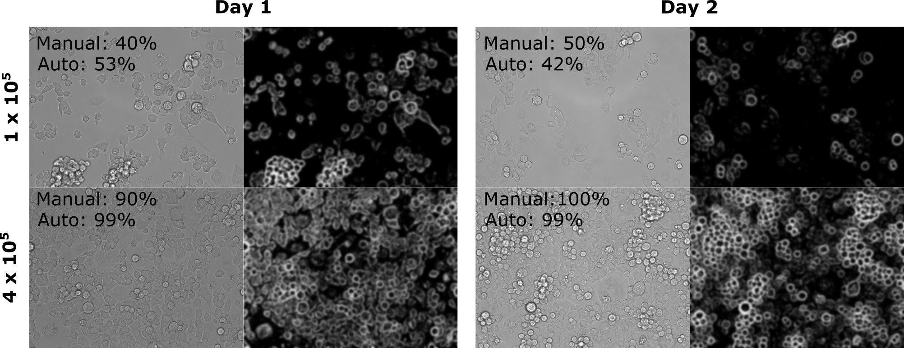
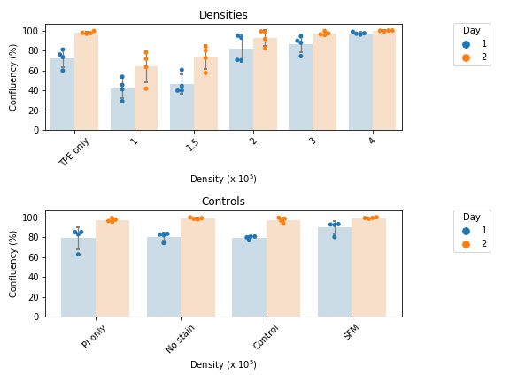
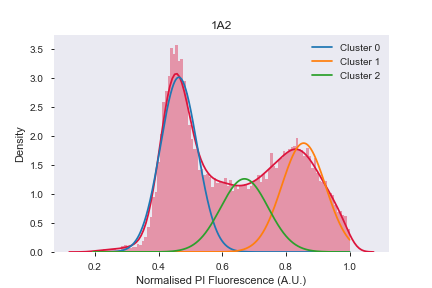
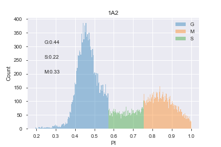

# GEN_Cell culture

This package contains a collection of simple javascript, jython and python scripts for processing image and flow-cytometry data. These modules were designed to collect parameters about cells in culture, such as confluency via brightfield images, or proportion of cells in each phase of the cell cycle.

Please note that these are short scripts that I use routinely in my own work, and I do not guarantee their useability or compatibility with other applications. Lastly, these scripts are designed for interactive variable management and running (not for command-line use) - see example notebooks [here](examples/jupyter/).


<!-- ## Getting Started

__These instructions will get you a copy of the project up and running on your local machine for development and testing purposes. See deployment for notes on how to deploy the project on a live system.__ -->

### Prerequisites

This package assumes the standard installation of Python 3.7 or later. For specific package requirements, see the [requirements.txt](requirements.txt) file.

In addition, jython scripts and ImageJ macros require installation of an ImageJ distribution, [FiJi](https://imagej.net/Fiji/Downloads). The code provided here has been tested using ImageJ v 1.52i.

### Installing

You can install the python scripts included in this repo using pip:

```python -m pip install git+https://github.com/dezeraecox/GEN_cell_culture#egg=GEN_cell_culture```

### Example applications

1. Confluency from brightfield images

- This technique should work on any folder of brightfield ```.tif``` images of cells in culture
- FiJi Functionality:
  - Each image is transformed using combination of gaussian blur and thresholding
  - The proportion of pixels occupied by cell structure is determined as an estimate of confluency
  - data is outputted to .csv for processing in python

<p align="center">
  
</p>

- Python functionality
  - Takes import of measurements from FiJi and groups replicates according to provided sample identifiers
  - Produces scattbar plot grouped according to sample identifiers

<p align="center">
  
</p>

2. Proportion of cells in each phase of cell cycle

- Cells stained with propidium iodide (PI; see example protocols [here]()) are analysed via flow cytometry
- Flow cytometry files can then pre-processed using a suitable analysis program (e.g. [FlowJo](https://www.flowjo.com/), [FlowCytometryTools](https://pypi.org/project/FlowCytometryTools/))
- PI fluorescence is then exported for individual cells to ```.csv```
- This module then plots PI histogram, fits distribution with 3-phase gaussian fits to assign cell cycle stage (G0/1, S, G2/M)

Model            |  Prediction
:-------------------------:|:-------------------------:
  |  


- Using fits, cells are then binned into each phase to allow other parameters to be calculated (e.g. median of other fluorescent channels) for each phase


## Authors

* **Dezerae Cox** - *Initial work* - [dezeraecox](https://github.com/dezeraecox)


## License

This project is licensed under the MIT License - see the [LICENSE.md](LICENSE.md) file for details

## Acknowledgments

* Templates for this package were adapted from [PurpleBooth](https://github.com/PurpleBooth)
* Kudos to the [2018 Asia-Pacific Advanced Scientific Programming in Python (#ASPP) Summer School](https://www.melbournebioinformatics.org.au/aspp-asia-pacific/) for giving me the condfidence and tools to tackle my first python package!
